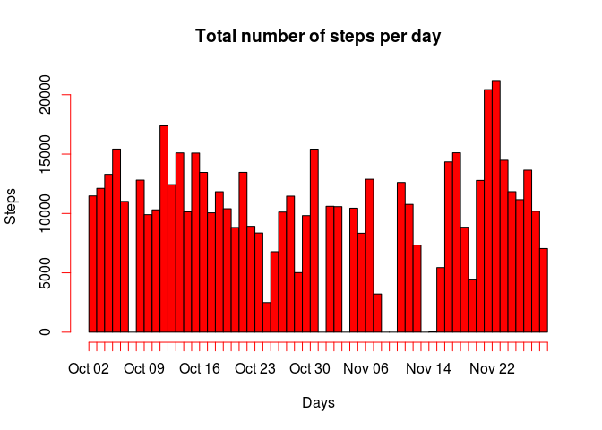
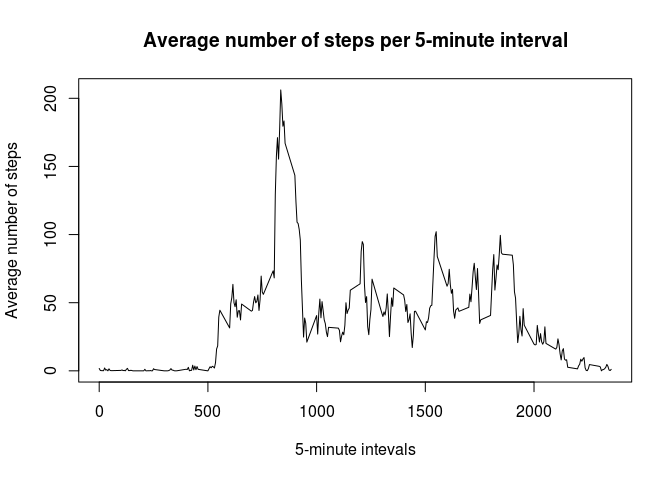
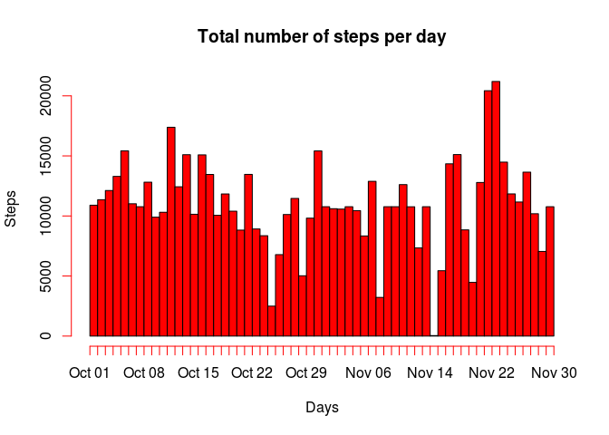
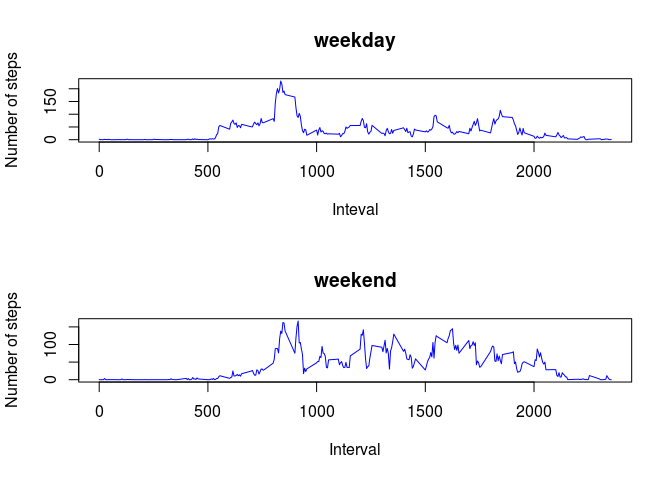

# Reproducible Research: Peer Assessment 1


## Loading and preprocessing the data

### 1. Load the data


```r
Sys.setlocale("LC_TIME", "en_US.utf8")
```

```
## [1] "en_US.utf8"
```

```r
activity <- read.csv("activity.csv")
```

### 2. Process/transform the data (if necessary) into a format suitable for your analysis

* Converting the second column to the "Date" class


```r
activity$date <- as.Date(activity$date)
```

* Removing NA values (for the first two questions)


```r
act_valid <- activity[!is.na(activity$steps),]
```

## What is mean total number of steps taken per day?

### 1. Make a histogram of the total number of steps taken each day


```r
act_sum <- by(act_valid$steps,act_valid$date,sum)

dates <- as.Date(names(act_sum))
steps <- as.integer(act_sum)

dates <- rep(dates,steps)

hist(dates, breaks = "days", freq=TRUE, col = "red", main = "Total number of steps per day", xlab = "Days", ylab = "Steps")
```

 

### 2. Calculate and report the mean and median total number of steps taken per day


```r
mean(act_sum)
```

```
## [1] 10766.19
```

```r
median(act_sum)
```

```
## 2012-11-12 
##      10765
```

## What is the average daily activity pattern?

### 1. Make a time series plot (i.e. type = "l") of the 5-minute interval (x-axis) and the average number of steps taken, averaged across all days (y-axis)


```r
act_avg <- by(act_valid$steps,act_valid$interval,mean)
plot(x = names(act_avg),y = act_avg, type = "l", 
     main = "Average number of steps per 5-minute interval", 
     xlab = "5-minute intevals", 
     ylab = "Average number of steps")
```

 

### 2. Which 5-minute interval, on average across all the days in the dataset, contains the maximum number of steps?


```r
names(act_avg[act_avg == max(act_avg)])
```

```
## [1] "835"
```

## Imputing missing values

### 1. Calculate and report the total number of missing values in the dataset (i.e. the total number of rows with NAs)


```r
sum(!complete.cases(activity))
```

```
## [1] 2304
```

### 2. Devise a strategy for filling in all of the missing values in the dataset

I have chosen the mean for the 5-minute interval to fill the NA values.

### 3. Create a new dataset that is equal to the original dataset but with the missing data filled in


```r
act_full <- activity   

for (i in 1:nrow(act_full)) 
{
        if (is.na(act_full[i,1]))
                act_full[i,1] <- act_avg[names(act_avg) == act_full[i,3]]   
}
```

### 4. Make a histogram of the total number of steps taken each day and Calculate and report the mean and median total number of steps taken per day. Do these values differ from the estimates from the first part of the assignment? What is the impact of inputing missing data on the estimates of the total daily number of steps?


```r
act_full_sum <- by(act_full$steps,act_full$date,sum)

dates_full <- as.Date(names(act_full_sum))
steps_full <- as.integer(act_full_sum)

dates_full <- rep(dates_full,steps_full)

hist(dates_full, breaks = "days", freq=TRUE, col = "red", main = "Total number of steps per day", xlab = "Days", ylab = "Steps")
```

 

```r
mean(act_full_sum)
```

```
## [1] 10766.19
```

```r
median(act_full_sum)
```

```
## 2012-11-04 
##   10766.19
```

With the input of the missing data, we can see that the mean approximates the median (in this case, they are equal). One explanation is that, with more values being considered, the mean is less afected by the limit values.

## Are there differences in activity patterns between weekdays and weekends?

### 1. Create a new factor variable in the dataset with two levels - "weekday" and "weekend" indicating whether a given date is a weekday or weekend day.


```r
weekdays <- weekdays(act_full$date)

act_full <- cbind(act_full,weekdays)

act_full$weekdays <- as.character(act_full$weekdays)

act_full[act_full$weekdays %in% 
                 c('Monday','Tuesday','Wednesday',
                   'Thursday','Friday'),4] <- 'weekday'

act_full[act_full$weekdays %in% 
                 c('Saturday','Sunday'),4] <- 'weekend'

act_full$weekdays <- as.factor(act_full$weekdays)
```

### 2. Make a panel plot containing a time series plot (i.e. type = "l") of the 5-minute interval (x-axis) and the average number of steps taken, averaged across all weekday days or weekend days (y-axis). 


```r
act_weekday <- act_full[act_full$weekdays == 'weekday',]
act_weekend <- act_full[act_full$weekdays == 'weekend',]

act_weekday_avg <- by(act_weekday$steps,act_weekday$interval,mean)
act_weekend_avg <- by(act_weekend$steps,act_weekend$interval,mean)

par(mfrow = c(2, 1))

plot(x = names(act_weekday_avg),y = act_weekday_avg, type = "l", col = "blue",
     main = "weekday", 
     xlab = "Inteval", 
     ylab = "Number of steps")

plot(x = names(act_weekend_avg),y = act_weekend_avg, type = "l", col = "blue",
     main = "weekend", 
     xlab = "Interval", 
     ylab = "Number of steps")
```

 

We can see that, on weekends, the number of steps is generally higher than the number of steps during weekdays. 
